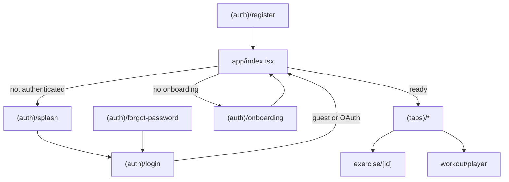
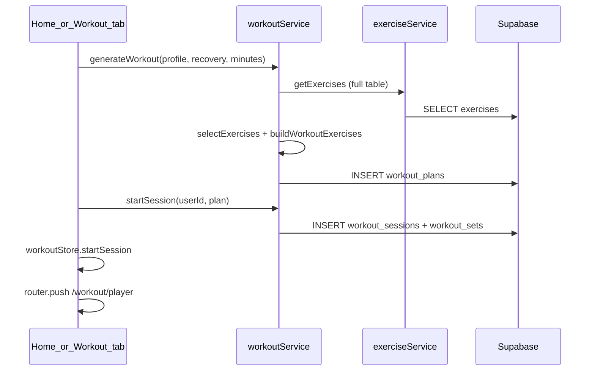

# Fit Guide — Phase 0 Codebase Audit

**Audit date:** 2026-09-28  
**Repository:** `fitguide` (package `fit-guide`)  
**Auditor role:** Implementation engineer (Cursor)  
**Basis:** Master implementation plan §6, §27; code is source of truth over `APP_SUMMARY.md`

---

## Executive summary

Fit Guide is a functional **Expo SDK 56 MVP** with Supabase-backed exercise library, heuristic workout generation, in-session tracking, recovery/progress reads, and rule-based “AI” recommendations. The architecture (Expo Router, Zustand, React Query, service layer) is coherent and should be **extended, not rewritten**.

**Production readiness:** Approaching internal launch; Sprint 1 production foundation (2026-09-28) adds linking, generic outbox, Edge delete, server engagement. **P0-class issues:** 8 resolved in Phase 1–2; Sprint 1 addresses linking, idempotency, delete, streaks.

| Metric | Value |
|--------|--------|
| P0 issues (audit registry) | 12 registered; **8 fixed** (AUDIT-001–008) |
| P1 issues | 18 |
| P2 issues | 8 |
| Typecheck | PASS |
| Unit tests | PASS (11 tests, 2 suites) |
| Committed `ios/` | No (prebuild when needed) |
| Local uncommitted work | Many modified/untracked files per git status at audit time (auth, services, DB seeds) |

**Recommended next step:** Senior review of P0 backlog → approve Phase 1 (guest/auth + DB/RLS) per master plan §26. **Do not implement features until approved.**

---

## 1. Actual repository structure

Matches master plan §2 with minor notes:

```text
fitguide/
├── app/                          # Expo Router screens
│   ├── index.tsx                 # Auth/onboarding gate
│   ├── _layout.tsx               # Root stack + providers
│   ├── (auth)/                   # splash, login, register, forgot-password, onboarding
│   ├── (tabs)/                   # home, workout, exercises, progress, profile
│   ├── exercise/[id].tsx
│   └── workout/player.tsx
├── src/
│   ├── components/               # ui, home, exercise, 3d/BodyMap, auth
│   ├── constants/                # app, exercises (SAMPLE unused), theme
│   ├── hooks/useFitness.ts       # React Query hooks (mostly unused by screens)
│   ├── providers/                # AuthProvider, QueryProvider
│   ├── services/                 # supabase, auth, exercises, workout, progress, nutrition, ai
│   ├── store/                    # authStore, workoutStore, appStore
│   ├── types/index.ts
│   └── utils/
├── database/
│   ├── migrations/001_initial_schema.sql
│   ├── setup_supabase.sql        # schema + RLS + ~100 exercise seeds
│   ├── setup_minimum.sql         # profiles + trigger only
│   └── seed_exercises.*.sql
├── scripts/
│   ├── native-env.sh
│   └── generate-exercise-seeds.mjs
├── assets/                       # icons, splash (not enumerated)
├── APP_SUMMARY.md                # collaboration doc (may lag code)
├── AGENTS.md                     # Expo v56 doc pointer
├── FITGUIDE_CODEBASE_AUDIT.md    # this file
└── FITGUIDE_CURSOR_FEEDBACK.md   # senior dev feedback protocol
```

**Not present:** `ios/`, `android/` in repo, EAS config, migration runner, offline sync module, error boundaries, crash/analytics SDKs.

---

## 2. Package and dependency versions

From [package.json](package.json) (runtime highlights):

| Package | Version |
|---------|---------|
| expo | ~56.0.12 |
| react | 19.2.3 |
| react-native | 0.85.3 |
| expo-router | ~56.2.11 |
| @supabase/supabase-js | ^2.108.2 |
| @tanstack/react-query | ^5.101.2 |
| zustand | ^5.0.14 |
| nativewind | ^4.2.6 |
| tailwindcss | ^3.4.19 |
| react-hook-form | ^7.80.0 |
| zod | ^4.4.3 |
| typescript | ~6.0.3 (dev) |

**Not in dependencies:** Victory Native, React Three Fiber, NetInfo, LLM SDKs, Sentry, Firebase.

---

## 3. Navigation map



**Gate logic** ([app/index.tsx](app/index.tsx)): `isLoading` → spinner; `!isAuthenticated` → splash; `!profile?.onboarding_completed` → onboarding; else tabs.

**Orphan routes:** `register` and `forgot-password` are in [app/(auth)/_layout.tsx](app/(auth)/_layout.tsx) but **not linked** from splash/login primary UX.

**Player:** Full-screen modal; redirects back if `activeSession` is null ([app/workout/player.tsx](app/workout/player.tsx)).

---

## 4. Authentication architecture

| Mode | Trigger | User ID | Supabase session | Profile |
|------|---------|---------|------------------|---------|
| Google OAuth | Login + `signInWithGoogle` | Real UUID | Yes | `profiles` row or onboarding |
| Email/password | Register/login (orphan UI) | Real UUID | Yes | DB / onboarding |
| Guest | `signInAsGuest` | `'guest'` string | No | In-memory `GUEST_PROFILE`, onboarding skipped |
| Demo | `signIn`/`signUp` when `!isSupabaseConfigured` | `'demo'` string | No | Local merge |
| Restored | `initialize()` + persisted Zustand | Guest/demo or Supabase | If configured | Persisted partial state |

**Key files:** [src/services/auth.ts](src/services/auth.ts), [src/store/authStore.ts](src/store/authStore.ts), [src/services/supabase.ts](src/services/supabase.ts), [src/components/auth/SocialSignInButtons.tsx](src/components/auth/SocialSignInButtons.tsx).

**OAuth:** Scheme `fitguide`, path `auth/callback` ([app.json](app.json) `scheme`). Apple implemented in store (`signInWithApple`) but **no UI button**.

**Persistence:** Zustand `fitguide-auth` on AsyncStorage; partializes guest/`rememberMe` rules. Supabase session on Secure Store (native) / AsyncStorage (web).

**Missing vs launch definition:** Account deletion, guest-to-account migration, guest-safe DB writes.

---

## 5. Onboarding architecture

**File:** [app/(auth)/onboarding/index.tsx](app/(auth)/onboarding/index.tsx)

- 8 steps: Welcome → About You → Body Stats → Goals → Experience → Schedule → Equipment → Health
- Step validation via `canProceed()`
- Completion: `completeOnboarding` → `profileService.saveProfile` + `recoveryService.initializeForUser` when Supabase configured; else local profile merge
- OAuth users may prefill name via `getOAuthDisplayName`

**Gaps:** No post-onboarding profile edit UI; goals not deeply wired into nutrition macros (hardcoded BMR inputs in nutrition service).

---

## 6. State management architecture

| Store | Persisted | Responsibility |
|-------|-----------|----------------|
| [authStore](src/store/authStore.ts) | Yes | User, profile, guest/demo, onboarding draft |
| [workoutStore](src/store/workoutStore.ts) | **No** | Active session, set indices, rest timer |
| [appStore](src/store/appStore.ts) | Yes | Streak, achievements, cached workouts (20), water ml, `isOffline` |

**Risk:** Active workout lives only in RAM; process kill loses session progress.

---

## 7. React Query architecture

**Provider:** [src/providers/QueryProvider.tsx](src/providers/QueryProvider.tsx) — `staleTime: 5m`, `retry: 2`.

**Usage pattern:** Tab screens use **inline** `useQuery` with keys like `['recovery', userId]`, `['exercises', filters]`. [src/hooks/useFitness.ts](src/hooks/useFitness.ts) duplicates wrappers but is **not imported** by `app/` screens.

**Mutations:** `useLogWater` exists in hook file; no screen uses it.

**Invalidation:** Player invalidates `['recovery']`, `['workout-sessions']` on finish.

---

## 8. Supabase architecture

**Client:** [src/services/supabase.ts](src/services/supabase.ts)

- `isSupabaseConfigured`: both `EXPO_PUBLIC_SUPABASE_URL` and `EXPO_PUBLIC_SUPABASE_ANON_KEY` set (no validation of placeholder values)
- Falls back to `placeholder.supabase.co` / `placeholder-key` if unset (client still constructed)

**Services:** All domain writes go through `src/services/*` using anon key + user JWT (when authenticated).

**Bootstrap paths:**

| Script | Purpose |
|--------|---------|
| `database/setup_minimum.sql` | Profiles + `handle_new_user` trigger |
| `database/setup_supabase.sql` | Full schema + RLS + exercise seeds |
| `database/migrations/001_initial_schema.sql` | Canonical schema reference |

No automated migration application in CI or app.

---

## 9. Database schema

**Source:** [database/migrations/001_initial_schema.sql](database/migrations/001_initial_schema.sql)

**User-scoped tables (FK → `auth.users`):** `profiles`, `goals`, `workout_plans`, `workout_sessions`, `progress`, `measurements`, `nutrition_logs`, `water_logs`, `recovery`, `achievements`, `notifications`, `notification_preferences`, `body_scans`

**Workout detail:** `workout_sets` → `workout_sessions` → `auth.users` (indirect RLS)

**Catalog:** `muscle_groups`, `exercise_categories`, `exercises`

**Unused by app code:** `exercise_media`, `goals`, `achievements` (DB), `notifications`, `notification_preferences`, `body_scans`, `water_logs` (service exists; limited UI)

**Triggers:** `on_auth_user_created` → stub profile; `updated_at` on `profiles`, `recovery`

---

## 10. RLS policies

- User tables: `auth.uid() = user_id` (sets via subquery on sessions)
- Catalog: public `SELECT` on `exercises`, `exercise_categories`, `muscle_groups`
- **`exercise_media`:** table created; **RLS not enabled** and **no policies** in migration — irrelevant until client reads media; if RLS enabled later without policy, reads would fail

**Indexes:** `profiles`, `workout_sessions`, `workout_sets`, `progress`, `recovery`, `exercises.primary_muscle`

**Not audited in live Supabase:** Policy drift vs `setup_supabase.sql` (idempotent DROP/CREATE) — verify on deployment.

---

## 11. Workout generation flow



**Heuristic engine** ([src/services/workout.ts](src/services/workout.ts)): equipment + recovery filter, compound/isolation mix, shuffle, ~1 exercise per 8 minutes (max 8). UI copy says “AI”; no LLM.

**Requires:** Seeded `exercises` and valid `user_id` UUID for inserts.

---

## 12. Workout player flow

1. Load `activeSession` from [workoutStore](src/store/workoutStore.ts)
2. Adjust weight/reps; `completeSet` updates local sets
3. Rest timer via `setInterval` + haptics
4. `doFinish`: `finishWorkout()` → `workoutService.completeSession` → `addCachedWorkout` + `updateStreak` → `recoveryService.updateRecoveryAfterWorkout` → invalidate queries → `router.back()`

**Gaps:** No try/catch on `doFinish` (failed Supabase → unhandled rejection, local store already cleared). No resume after app kill. No RPE/RIR UI (column exists). Sets written at end in loop, not incrementally.

---

## 13. Recovery flow

- **Read:** `recoveryService.getRecoveryData` → auto-seed via `initializeForUser` if empty
- **Write:** `updateRecoveryAfterWorkout` after session complete
- **UI:** [RecoveryScore](src/components/home/RecoveryScore.tsx), [progress tab](app/(tabs)/progress.tsx)
- **Local helper:** `generateDefaultRecovery()` unused in screens
- **Guest/demo:** DB calls use invalid `user_id` → failures when Supabase on

---

## 14. Nutrition flow

- **Read:** `nutritionService.getTodayLog` on home
- **Write APIs:** `logNutrition`, `logWater` — **no logging UI** in tabs
- **Macros:** `calculateMacros` uses fixed height/age in formula ([nutrition.ts](src/services/nutrition.ts))
- **appStore:** `waterIntakeMl` / `addWater` not wired to Supabase from UI

---

## 15. Progress flow

- **Read:** `progressService.getProgress` with period filter on progress tab
- **Write:** `logProgress` exists — **no UI**
- **Chart:** [SimpleLineChart](src/components/ui/SimpleLineChart.tsx); body fat fallback `18` when missing on progress screen

---

## 16. AI coach flow

- **Service:** [src/services/ai.ts](src/services/ai.ts) — deterministic rules (recovery, streak, inactivity, goal tips)
- **UI:** [AIRecommendationCard](src/components/home/AIRecommendationCard.tsx)
- **No LLM API**, no structured context store, no graceful degradation beyond empty recommendations

Aligns with master plan direction (calculations deterministic); conversational layer not started.

---

## 17. Offline / cache behavior

| Concern | Current behavior |
|---------|------------------|
| Network detection | `appStore.isOffline` / `setOffline` — **never called** |
| Workout execution offline | **Broken** — `startSession`/`completeSession` require live Supabase |
| Set persistence | In-memory only until finish |
| Outbox / retry | **None** |
| Auth session | Persisted via Supabase adapter |
| Display cache | Last 20 workouts in `appStore` after successful finish only |

---

## 18. Error handling

**Strengths:** [exercises.ts](src/services/exercises.ts) friendly messages for missing schema/empty seed; some services return `[]` on missing tables (`getRecoveryData`, `getRecentSessions`).

**Weaknesses:**

- Player `doFinish` no user-facing error if sync fails after local clear
- Many screens: loading via React Query; inconsistent empty/error UI
- No app-wide error boundaries
- Supabase errors sometimes propagated raw from `workoutService.generateWorkout`

---

## 19. Current tests

| File | Coverage |
|------|----------|
| [src/services/__tests__/recovery.test.ts](src/services/__tests__/recovery.test.ts) | `calculateRecoveryScore`, `getOverallRecoveryScore` |
| [src/utils/__tests__/format.test.ts](src/utils/__tests__/format.test.ts) | format helpers |

**Commands run (2026-09-28):**

```bash
npm run typecheck   # PASS
npm test            # PASS — 2 suites, 11 tests
```

No component tests, no service integration tests, no RLS tests. `@testing-library/react-native` installed but unused.

---

## 20. Build configuration

| File | Notes |
|------|-------|
| [app.json](app.json) | Bundle IDs, dark UI, expo-router, notifications plugin, typed routes |
| [babel.config.js](babel.config.js) | expo + nativewind, reanimated plugin |
| [metro.config.js](metro.config.js) | NativeWind + `global.css` |
| [tsconfig.json](tsconfig.json) | `strict: true`, `@/*` paths |
| [jest.config.js](jest.config.js) | jest-expo preset |

**Scripts:** `start` / `ios` / `android` wrap [scripts/native-env.sh](scripts/native-env.sh) (PATH fix for broken `head`). Dev client workflow.

---

## 21. Environment configuration

[.env.example](.env.example):

```env
EXPO_PUBLIC_SUPABASE_URL=https://boajdgtpvhqwfmewanul.supabase.co
EXPO_PUBLIC_SUPABASE_ANON_KEY=your_supabase_anon_key
```

No secrets beyond public Supabase anon key. No feature flags.

---

## 22. Known bugs

See **Issue registry** (AUDIT-*). Highlights:

- Guest/demo IDs cause FK/RLS failures against real Supabase
- Workout state lost on process termination
- `doFinish` clears local session before confirmed server persist
- Register/forgot unreachable from primary auth UX

---

## 23. Missing functionality (vs master plan §4 launch definition)

Major gaps: offline queue, progressive overload, RPE/RIR UI, nutrition logging UI, measurements UI, notifications, account deletion, data export, PR detection, supersets, warm-up sets, exercise media, favorites, custom exercises, LLM coach layer, EAS/production checklist items.

---

## 24. Technical debt

- Duplicate React Query patterns (`useFitness` vs inline queries)
- `SAMPLE_EXERCISES` in constants unused
- Achievements: local `appStore` only, not `achievements` table
- Streak: local only, not reconciled with server sessions
- `setup_supabase.sql` duplicates migration (maintenance burden)
- Branding “AI” vs heuristic implementation

---

## 25. Security concerns

| ID | Concern |
|----|---------|
| AUDIT-020 | Guest/demo client IDs sent to Postgres — FK errors, not bypass; but encourages mixed architecture |
| AUDIT-021 | No client service role key (good) |
| AUDIT-022 | RLS model correct for user tables when using real auth UUID |
| AUDIT-023 | `exercise_media` policy gap if exposed without review |
| AUDIT-024 | Password reset redirect `fitguide://auth/reset-password` — screen may not exist |

Authorization is server-side via RLS; no evidence of trusting client `user_id` without session (except guest path attempting invalid IDs).

---

## 26. Performance concerns

| ID | Concern |
|----|---------|
| AUDIT-025 | `getExercises()` loads full library for every workout generation |
| AUDIT-026 | Large `setup_supabase.sql` for manual runs |
| AUDIT-027 | `completeSession` sequential `saveSet` per set (N round trips) |

---

## Plan conflicts (master plan vs repository)

### Phase numbering

- **§26** order: Phase 1 Auth/DB → Phase 2 Offline → Phase 3 Workout engine…
- **§7** bundles guest + offline + errors under “Phase 1 — Production Foundation”

**Recommendation:** Follow §26 sequencing for implementation; treat §7 as thematic grouping.

### AI positioning

- UI/marketing uses “AI”; implementation is rule-based ([ai.ts](src/services/ai.ts)). Matches partial §4 Coaching (deterministic core present; LLM layer absent).

### APP_SUMMARY.md

- Documents MVP well but may not reflect all local uncommitted changes (auth, seeds, social buttons). **This audit supersedes for engineering status.**

---

## Feature audit matrix (master plan §6)

| Feature | Current implementation | Key files | DB deps | Known bug | Missing | Priority | Recommended action |
|---------|------------------------|-----------|---------|-----------|---------|----------|-------------------|
| Authentication | Supabase OAuth/email + guest/demo | authStore, auth.ts, login | profiles | Guest FK | Account delete, migration | P0 | Anonymous auth or local-only guest |
| Onboarding | 8-step wizard | onboarding/index.tsx | profiles, recovery | Guest DB fail | Edit later | P1 | Fix guest first |
| Home | Dashboard + generate workout | (tabs)/index.tsx | many | Guest queries fail | Logging UI | P1 | P0 guest fix |
| Workout generation | Heuristic + DB insert | workout.ts, workout tab | exercises, plans | Guest FK | Progressive overload | P1 | Phase 3 engine |
| Workout player | Sets, rest, finish | player.tsx, workoutStore | sessions, sets | No error handling | Offline, resume | P0 | Persist + outbox |
| Exercises | Search, filter, body map | exercises.tsx, exercises.ts | exercises | Empty DB error | Favorites, media | P1 | Seed docs |
| Recovery | Scores + post-workout update | progress.ts, RecoveryScore | recovery | Guest FK | Overlap explain | P1 | — |
| Progress | Charts read-only | progress.tsx | progress | Fake body fat default | log UI, PRs | P1 | — |
| Nutrition | Read today log | nutrition.ts, NutritionCard | nutrition_logs | No log UI | Full logging | P1 | Phase 7 |
| AI coach | Rule cards | ai.ts, AIRecommendationCard | none | — | LLM layer | P2 | Phase 9 |
| Profile | Display + sign out | profile.tsx | — | Coming soon menus | Settings | P1 | Phase 10 |
| Settings | Stub alerts | profile.tsx | — | Rule 3 violation | Real settings | P1 | Implement or hide |
| Notifications | DB tables only | — | notifications | — | expo-notifications wiring | P2 | Phase 11 |
| Achievements | Local appStore | appStore.ts | achievements table unused | Not synced | DB achievements | P2 | — |
| Offline | Flag unused | appStore.ts | — | No queue | Full §4 offline | P0 | Phase 2 |
| Supabase | JS client v2 | supabase.ts | all | Placeholder fallback | Health check | P1 | — |
| RLS | In migration | 001_initial_schema.sql | — | exercise_media | Live audit | P1 | SQL review |
| State mgmt | Zustand 3 stores | store/* | — | workout not persisted | — | P0 | Persist session |
| Navigation | Expo Router | app/* | — | Orphan register | Deep links reset | P1 | Link register |
| Error handling | Partial | services, screens | — | Player finish | Boundaries | P0/P1 | Phase 1.3 |
| Testing | 2 unit files | __tests__ | — | Low coverage | Integration | P1 | Phase 13 |

---

## Issue registry

| ID | Priority | Area | Current behavior | Expected behavior | Files | DB impact | Recommended implementation | Dependencies |
|----|----------|------|------------------|-------------------|-------|-------------|---------------------------|--------------|
| AUDIT-001 | P0 | Auth | ~~Guest `user_id='guest'`~~ | Valid auth user or isolated local data | authStore.ts | FK fail on user tables | Supabase Anonymous Auth or local-only mode | **Fixed** — anonymous auth + local IDs |
| AUDIT-002 | P0 | Auth | ~~Demo `user_id='demo'` with env set~~ | Same as AUDIT-001 | authStore.ts | FK fail | Remove demo IDs when Supabase on | **Fixed** |
| AUDIT-003 | P0 | Workout | ~~workoutStore ephemeral~~ | Survive app kill | workoutStore.ts | — | Persist active session + sets | **Fixed** — Zustand persist |
| AUDIT-004 | P0 | Offline | ~~No outbox~~ | Queued mutations | sync/outbox.ts | — | Phase 2 outbox pattern | **Fixed** — complete_workout queue |
| AUDIT-005 | P0 | Workout | ~~`finishWorkout` before server OK~~ | Server confirm or rollback UI | player.tsx | Partial writes possible | Try/catch + local queue | **Fixed** |
| AUDIT-006 | P0 | Workout | ~~`startSession` requires network~~ | Offline start | workout.ts | — | Local session ID + sync | **Fixed** — buildLocalSession fallback |
| AUDIT-007 | P0 | Auth | ~~Guest skips onboarding~~ | Consistent product rules | authStore.ts | — | Decide guest profile source | **Fixed** — guests route through onboarding |
| AUDIT-008 | P0 | Error handling | ~~Unhandled rejection on finish fail~~ | User message + retry | player.tsx | — | Error state component | **Fixed** — alert + outbox |
| AUDIT-009 | P1 | Navigation | ~~Register/forgot orphaned~~ | Reachable from login | login.tsx, splash.tsx | — | Add links | **Fixed** — login links |
| AUDIT-010 | P1 | Product | ~~Profile menu “coming soon”~~ | Working or hidden | profile.tsx | — | Implement or remove per Rule 3 | **Fixed** Sprint 1+10 |
| AUDIT-011 | P1 | Nutrition | ~~No log UI~~ | Food/water logging | nutrition/log.tsx | nutrition_logs | Phase 7 screens | **Fixed** |
| AUDIT-012 | P1 | Progress | ~~`logProgress` unused~~ | Measurement logging | progress.tsx | progress | UI + forms | **Fixed** |
| AUDIT-013 | P1 | Auth | ~~Apple sign-in hidden~~ | Apple on iOS if retained | SocialSignInButtons | — | Add button + test | **Fixed** |
| AUDIT-014 | P1 | Data | ~~Streak local only~~ | Server-backed or defined | engagement.ts, user_engagement | — | Define source of truth | **Fixed** Sprint 1 (RPC + cache) |
| AUDIT-015 | P1 | Data | ~~Achievements local only~~ | DB sync optional | recompute_achievements RPC | achievements | Wire or drop table | **Fixed** Sprint 1 (server recompute) |
| AUDIT-016 | P1 | DX | `useFitness` unused | Single query pattern | useFitness.ts, app/* | — | Adopt hooks or delete | — |
| AUDIT-017 | P1 | Supabase | Placeholder URL if env partial | Fail fast in dev | supabase.ts | — | Stricter config check | — |
| AUDIT-018 | P1 | Progress | Body fat defaults to 18 | Show empty/— | progress.tsx | — | UI fix | — |
| AUDIT-019 | P1 | Nutrition | Macros ignore profile age/height | Use profile | nutrition.ts | — | Use profile fields | — |
| AUDIT-020 | P1 | Security | ~~Guest writes attempted~~ | No invalid writes | services/* | FK errors | AUDIT-001 | **Fixed** — `canSyncUserToSupabase` guards |
| AUDIT-028 | P1 | Workout | ~~No abandoned session resume~~ | Resume prompt | workout tab | — | Detect persisted session | **Fixed** — persisted store + Resume card |
| AUDIT-021 | P2 | RLS | exercise_media no policies | Policy when used | 001_initial_schema.sql | exercise_media | SELECT policy | Media feature |
| AUDIT-022 | P2 | Auth | Reset password deep link | Handler screen | forgot-password.tsx | — | Add route or change redirect | — |
| AUDIT-023 | P2 | Performance | Full exercise fetch | Paginated/filtered server | workout.ts | — | Query by equipment | — |
| AUDIT-024 | P2 | Performance | Sequential saveSet | Batch upsert | workout.ts | — | Single RPC or batch | — |
| AUDIT-025 | P2 | Testing | 11 unit tests | Broad coverage | — | — | Phase 13 | — |
| AUDIT-026 | P2 | AI | Heuristic only | LLM explanation layer | ai.ts | — | Phase 9 | — |
| AUDIT-027 | P2 | Notifications | Plugin in app.json | Scheduled reminders | — | notifications | Phase 11 | — |
| AUDIT-029 | P1 | Workout | No RPE in UI | RPE/RIR capture | player.tsx | workout_sets.rpe | Input + store | Phase 4 |
| AUDIT-030 | P1 | Launch | ~~No account deletion~~ | GDPR-style delete | delete-account Edge Fn | auth.users | Supabase admin/API | **Fixed** Sprint 1 (deploy EF) |

---

## P0 backlog (ordered)

1. **AUDIT-001** — Guest architecture vs Supabase FKs (blocking guest + configured backend)
2. **AUDIT-002** — Demo user IDs when Supabase configured
3. **AUDIT-003** — Persist active workout session locally
4. **AUDIT-004** — Offline mutation outbox + sync
5. **AUDIT-005** — Safe workout completion (don’t clear before server ack)
6. **AUDIT-006** — Offline-capable session start
7. **AUDIT-007** — Guest onboarding/profile consistency
8. **AUDIT-008** — Player error handling / user recovery path

*Note: AUDIT-005/006/008 depend on offline/session design (Phase 2); AUDIT-001 is Phase 1 blocker per §26.*

---

## P1 backlog (summary)

AUDIT-009 through AUDIT-019, AUDIT-028, AUDIT-029, AUDIT-030 — navigation, Rule 3 stubs, logging UIs, auth polish, data truth, macros, hooks consolidation, resume, RPE, account deletion.

---

## P2 backlog (summary)

AUDIT-021 through AUDIT-027 — media RLS, password deep link, query performance, test expansion, LLM layer, notifications.

---

## Recommended implementation order

Per master plan §26 (stop after senior approval of P0):

1. Phase 0 — **this audit** (complete)
2. Phase 1 — Auth, guest, database, RLS (AUDIT-001, 002, 007, 020)
3. Phase 2 — Offline architecture (AUDIT-003–006, 005, 008)
4. Phase 3+ — Workout engine, player, exercise platform, etc.

**Do not start Phase 1 implementation until senior developer reviews this document and P0 ordering.**

---

## Appendix A — Service → table mapping

| Service | Tables |
|---------|--------|
| profileService (auth.ts) | profiles |
| exerciseService | exercises, exercise_categories |
| workoutService | workout_plans, workout_sessions, workout_sets |
| recoveryService / progressService | recovery, progress, measurements |
| nutritionService | nutrition_logs, water_logs |
| aiCoachService | (none) |

---

## Appendix B — React Query keys (observed)

| Key | Screen/service |
|-----|----------------|
| `['exercises', filters]` | exercises tab |
| `['exercise', id]` | exercise detail |
| `['exercise-history', userId, id]` | exercise detail |
| `['recovery', userId]` | home, workout, progress |
| `['nutrition', userId]` | home |
| `['progress', userId, period]` | home, progress |
| `['workout-sessions', userId]` | home |

---

## Appendix C — Completion checklist (Phase 0)

- [x] Implementation complete (audit only)
- [x] Types pass
- [x] Relevant tests pass
- [ ] Manual device testing (not performed — audit only)
- [x] Known issues documented
- [x] No duplicate architecture introduced
- [x] Documentation updated (this file + feedback)
